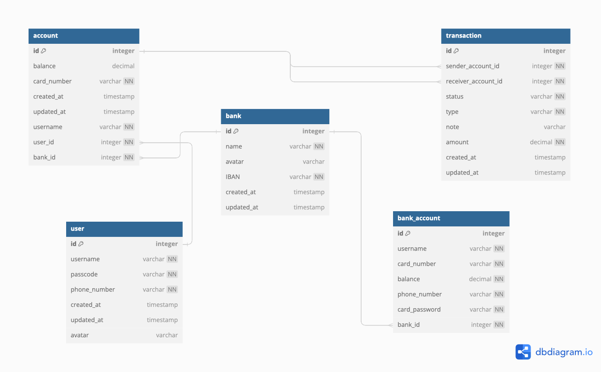

 

 

# Finaxis - Secure Banking App for Android and iOS

Finaxis is a cutting-edge banking application designed for both Android and iOS platforms, offering a seamless and secure way to manage your finances. Whether you're transferring funds, managing accounts, or tracking your transaction history, Finaxis provides an intuitive and efficient banking experience tailored to meet the needs of modern users.

## Goal 👀
The primary goal of the Finaxis project is to enhance my skills by practicing and exploring new technologies. Specifically:

- Compose Multiplatform: To gain hands-on experience with Jetpack Compose Multiplatform, enabling the creation of a unified user interface across Android and iOS platforms.
- Backend Development with Spring Boot: To practice building a custom backend using Spring Boot, providing a robust and scalable server-side solution rather than relying on external APIs.
This project serves as a learning opportunity to deepen my understanding of cross-platform development and backend engineering.

## Project Structure and Design Principles 🛠

**Finaxis** is developed using the MVC (Model-View-Controller) pattern within the Spring Boot framework to ensure a clear separation of concerns and a robust architecture. The application is organized into three primary layers, each serving a distinct purpose:

### 1. **Presentation Layer (Controller)**
- **Responsibility:** Manages user interactions and handles HTTP requests and responses.
- **Technology:** Utilizes Spring MVC controllers to define request mappings and handle user input.
- **Features:** Processes user requests, interacts with service layer components, and returns responses in various formats (e.g., HTML, JSON).
- **Purpose:** Ensures that user interactions are processed in a centralized manner, providing a clear interface between the user and the business logic.

### 2. **Service Layer**
- **Responsibility:** Contains the core business logic and application services.
- **Components:** Includes service classes that implement business rules and orchestration.
- **Features:** Acts as an intermediary between the controller and data layers, handling complex business processes and validations.
- **Purpose:** Provides a layer of abstraction between the presentation and data layers, ensuring that business logic is separated from user interface concerns and data access.

### 3. **Data Layer (Repository)**
- **Responsibility:** Manages data access and persistence.
- **Technology:** Uses Spring Data JPA or similar technologies to interact with databases.
- **Components:** Includes repository interfaces and entity classes that map to database tables.
- **Features:** Provides data access methods for CRUD operations and complex queries, abstracting database interactions from the service layer.
- **Purpose:** Encapsulates data access logic, ensuring that data operations are handled efficiently and are easily replaceable if data storage mechanisms change.

---

This MVC-based architecture ensures that each layer of the application has a distinct responsibility, facilitating easier maintenance, scalability, and testing. The clear separation of concerns helps in organizing the codebase, improving readability, and enhancing the overall development process.

## Database Schema 📊

The following diagram illustrates the database schema for the **Finaxis** project:

## 🚀 Future Plans

In the coming updates, we plan to enhance the project with the following features:

1. **New Endpoints:** Introducing new API endpoints to support features like transaction history, user notifications, and advanced analytics.

2. **Security Upgrades:** Implementing additional security measures to safeguard against vulnerabilities, enhance data protection, and ensure compliance with industry standards.

3. **Documentation and Testing:** Improving API documentation and adding comprehensive tests to ensure reliability and ease of use for developers.

## 🛠 Built With

**Finaxis** utilizes the following technologies and tools:

- **[Spring Boot](https://spring.io/projects/spring-boot)** - Framework for building production-ready Spring-based applications with minimal configuration.
- **[Spring Security](https://spring.io/projects/spring-security)** - Provides comprehensive security services for Java applications.
- **[Spring Data JPA](https://spring.io/projects/spring-data-jpa)** - Simplifies data access with JPA, providing an easier way to interact with relational databases.
- **[Lombok](https://projectlombok.org/)** - Java library that helps to reduce boilerplate code using annotations.
- **[Java JWT](https://github.com/auth0/java-jwt)** - Library for creating and verifying JSON Web Tokens (JWTs).
- **[MySQL Connector/J](https://dev.mysql.com/downloads/connector/j/)** - JDBC driver for connecting to MySQL databases.
- **[JUnit](https://junit.org/junit4/)** - Framework for writing and running tests in Java.
- **[Maven](https://maven.apache.org/)** - Build automation tool used for managing project dependencies and build processes.

These tools and libraries form the backbone of the **Finaxis** backend, providing a robust foundation for building scalable and secure web applications.

https://lucid.app/lucidchart/91389e99-8d11-4e2d-b32c-bacd7c907dbe/edit?viewport_loc=-840%2C-1217%2C1406%2C612%2C0_0&invitationId=inv_b4dc7669-da39-4f0c-b0ab-440e8adb2b7b
